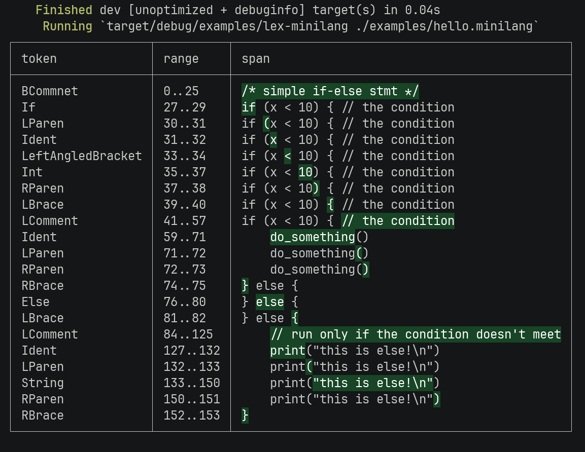

<h1 align="center">Highlight Span</h1>
<p align="center">$\mathcal O(\log n)$ span highlighter</p>

## Demo

You can try demo locally. We wil try to lex a simple language called 'minilang'. (see lexer source [here](./examples/lex-minilang.rs))

```sh
$ git clone https://github.com/abiriadev/highlight-span && cd highlight-span
$ cargo run --example lex-minilang ./examples/hello.minilang | cargo run ./examples/hello.minilang
```

### Result


